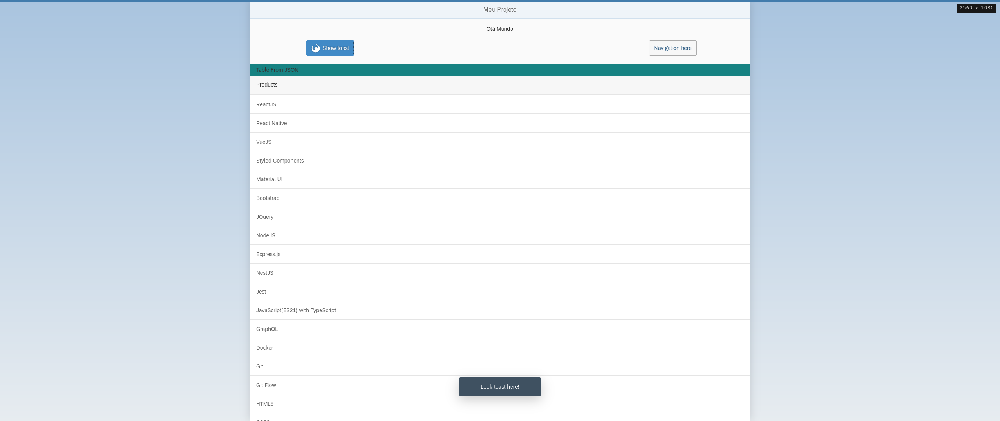
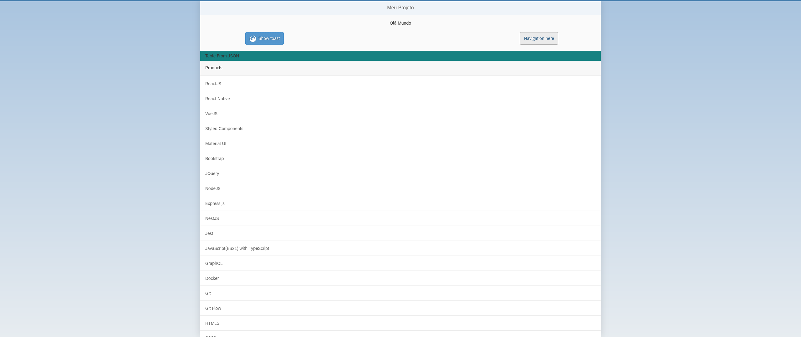

# test-newoxygen
### Made with 
- SAPUI5
- JavaScript

## First
Download the project.
If you have "ssh" configured, run:
```sh
  git clone git@github.com:pauloteixeira01/test-newoxygen.git
```

else, run: 
```sh
  git clone https://github.com/pauloteixeira01/test-newoxygen.git
```
Enter the project directory:
```sh
  cd test-newoxygen
```
## Second
You need to install "serve", so run:
```sh
  npm i --global serve
```

## Third
Run "serve" command:
```sh
  serve
```

This way:


## Finally
Type in browser URL:
```sh
  http://localhost:3000/webapp/
```
Ready!








